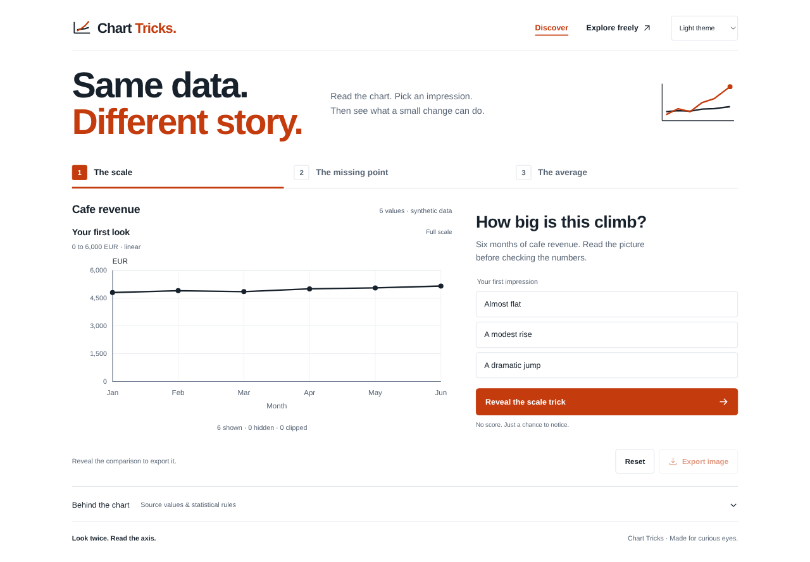

# Chart Tricks

**Same data, different impression.**

Change a chart's range, choose a mean or median guide, and hide flagged points. Compare each view with the unchanged reference.

[Open the demo](https://assem130.github.io/chart-tricks/) · [Run locally](#run-locally) · [Data and rules](#data-and-rules) · [Release packages](https://github.com/Assem130/chart-tricks/releases/latest)

<picture>
  <source media="(prefers-color-scheme: dark)" srcset="docs/media/desktop-dark.png">
  
</picture>

**Every statistic uses every source value, including points you hide.**

## Try one comparison

1. Choose **One large order**.
2. Select **Mean**.
3. Enable **Hide outliers**.

Seven points remain visible. The mean stays **46.88 EUR** and the median stays **28.50 EUR** because both include all eight orders.

The hidden **180 EUR** order still affects the mean. The chart names that point and shows that the mean lies above the modified range.

## Change the view

| Control | What changes |
| --- | --- |
| Axis bounds and Scale focus | Adjust the Modified range. The Reference keeps its full range. |
| Mean or Median | Choose the guide in both charts. Both summary values remain visible. |
| Hide outliers | Hide flagged markers in Modified. Counts and explanations disclose each hidden value. |
| Theme | Choose System, Light, or Dark. The browser saves your choice locally. |
| Reset | Keep the dataset and theme. Restore the tighter range, Median, and visible outliers. |
| Export image | Download both charts as a labelled, 2880-pixel-wide PNG in the current theme. |

The PNG includes ranges, units, summaries, visibility counts, explanations, the outlier rule, and exact source values. It uses a readable comparison layout.

A tighter axis can reveal small differences and make them look larger. Hiding a flagged point can reveal a cluster and obscure part of the distribution. Compare the stated ranges and disclosures before interpreting either view. An outlier flag does not establish that a value is wrong.

## Run locally

Use **Node.js 22.18 or newer** and npm. CI uses the version in [`.node-version`](.node-version).

```sh
npm ci
npm run dev
```

To check the project and inspect the production build, use these commands.

```sh
npm test
npm run typecheck
npm run build
npm run preview
```

### Why this stack

TypeScript and Vite provide type checks, local development, and static builds. Native SVG gives precise geometry that the app and exporter share. Native Canvas creates the PNG. Node's built-in test runner checks the numerical logic.

There are **two development dependencies and no runtime dependencies**. The app needs no backend, accounts, analytics, paid APIs, or external fonts.

## Data and rules

All three datasets are synthetic and authored for Chart Tricks. They do not describe a real cafe, shop, or survey.

| Dataset | Pattern | Unit |
| --- | --- | --- |
| Cafe revenue | A steady climb across six months | EUR |
| One large order | Seven small orders and one large order | EUR |
| Survey scores | Eight closely grouped scores | % |

Both charts use linear scales and the same observation order. Only monthly revenue points connect with a line. Orders and survey groups use dots.

<details>
<summary>Exact source values and axis ranges</summary>

The values also appear in [`src/model.ts`](src/model.ts) and the app's **Source data & statistical rules** section.

| Dataset | Source values | Reference range | Reset range |
| --- | --- | --- | --- |
| Cafe revenue, Jan to Jun | 4800, 4900, 4850, 5000, 5050, 5150 | 0 to 6000 EUR | 4500 to 5500 EUR |
| One large order, orders 1 to 8 | 24, 26, 27, 28, 29, 30, 31, 180 | 0 to 200 EUR | 0 to 40 EUR |
| Survey scores, groups A to H | 72, 79, 76, 81, 78, 75, 80, 77 | 0 to 100 % | 70 to 85 % |

</details>

<details>
<summary>Statistics, outliers, and visibility</summary>

- Mean is the arithmetic average. Median is the middle sorted value, or the average of the two middle values for an even count.
- Q1 and Q3 are the medians of the lower and upper halves. Exclude the middle value for an odd count. A singleton has Q1 = Q3 and IQR = 0.
- IQR = Q3 − Q1. Flag values strictly below Q1 − 1.5 × IQR or above Q3 + 1.5 × IQR. Equality with a fence is not flagged.
- The large-order dataset flags only 180 EUR. Q1 = 26.5, Q3 = 30.5, and the fences are 20.5 and 36.5 EUR.
- Hidden points meet the outlier rule and have no marker in Modified. Clipped points fall outside the range and get boundary triangles. The counts do not overlap. A triangle identifies clipping, not the actual point position.
- Every summary and outlier calculation uses all source values. A guide outside the range gets a text notice instead of a false edge position.

</details>

<details>
<summary>Custom ranges and saved state</summary>

Scale focus moves between the full reference range and the tighter preset. Custom bounds accept finite values from −1,000,000 to 1,000,000, with a minimum span of 0.01.

Invalid fields keep the last valid chart and disable export until you correct them. Changing the dataset starts its preset. Reloading starts Cafe revenue and keeps only the saved theme preference.

System follows the browser's appearance setting. Reset preserves the current theme. Storage restrictions do not prevent manual theme selection.

</details>

## Checks and limits

The 16 behavior checks cover statistics, quartiles, visibility, scale transformations, range validation, reset, themes, and export content. Theme checks also cover chart contrast and identical data, statistics, and coordinates.

Chromium checks cover desktop and narrow mobile layouts, interactions, saved themes, and actual PNG downloads. Independent pixel checks compare exported point positions and check hidden-point absence.

Physical phones, Safari, Firefox, and screen reader sessions remain untested. Browser download permissions can affect file delivery. These small examples illustrate presentation choices, not inference, uncertainty, or causation. Other quartile conventions can produce different outlier fences. The app supports only linear scales.

## Host a static build

Run `npm ci`. Run `npm run build`. Host **only `dist/`** on GitHub Pages or another static host. The relative asset base supports a project subdirectory. The app needs no credentials, server functions, or route rewrites.

For GitHub Pages, select **GitHub Actions** under **Settings → Pages → Source**. The [included workflow](.github/workflows/pages.yml) tests and builds the app before deploying `dist/` from `main`. Pull requests run checks without deployment.

For another build service, use `npm run build` and output directory `dist`. See [GitHub's Pages workflow instructions](https://docs.github.com/en/pages/getting-started-with-github-pages/using-custom-workflows-with-github-pages).

## Release packages and privacy

The [GitHub release](https://github.com/Assem130/chart-tricks/releases/latest) contains a source ZIP, a static ZIP, and `SHA256SUMS`. The static ZIP is ready for a static host. The source ZIP includes the app, tests, configuration, documentation, and build workflow.

To create the packages locally, build the app first. Run `npm run package`. This optional step needs Python 3 and uses only its standard library.

Packaging uses an explicit file allowlist and rejects unexpected files or symbolic links. It scans published text for common credentials, private keys, personal email addresses, and local home paths. These checks cannot detect every possible secret. Review new publication files before release.

Local design history, agent notes, browser traces, dependencies, environment files, and generated packages stay outside the source ZIP. Documentation screenshots show only the app.

The app has no network APIs or remote fonts. The browser stores only the theme preference and creates PNG exports locally.
